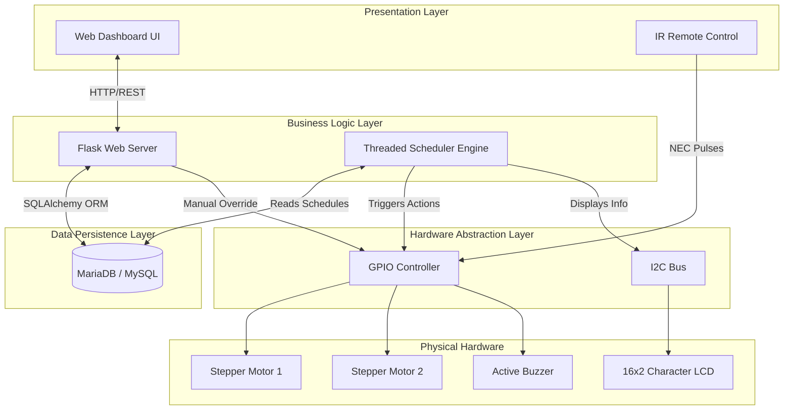
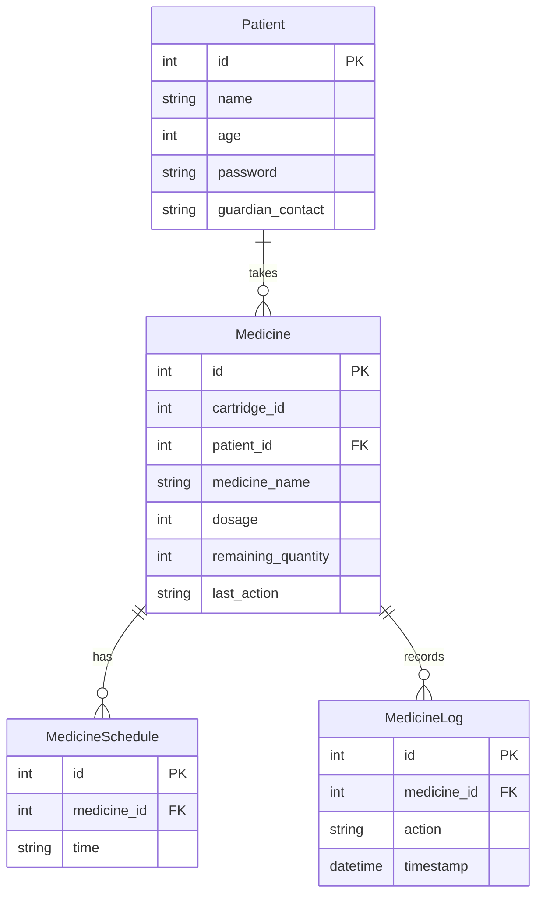
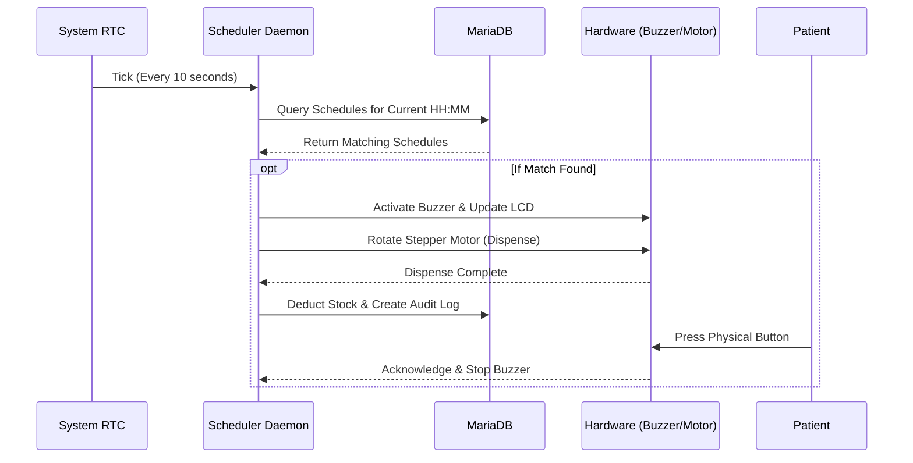

<div align="center">

# 💊 Smart Automatic Pill Dispenser System

*Next-generation Healthcare IoT Solution for Automated Medication Management*

[](https://python.org)
[](https://flask.palletsprojects.com/)
[](https://mariadb.org/)
[](https://www.raspberrypi.org/)
[](https://opensource.org/licenses/MIT)

[Project Overview](#-project-overview) •
[Features](#-features) •
[Hardware Setup](#%EF%B8%8F-hardware-components) •
[Installation](#-installation-guide) •
[API Reference](#-api-documentation)

</div>

---

## 📖 Project Overview

The **Smart Automatic Pill Dispenser System** is an enterprise-grade IoT healthcare solution designed to automate medication management. It bridges the gap between digital scheduling and physical dispensing, ensuring patients receive the right medication at precisely the right time.

**Problem Solved:** Medication non-adherence is a major healthcare challenge, leading to worsened health outcomes and increased medical costs. Manual pill organizers are prone to human error, missed doses, and double dosing.

**Our Solution:** By integrating a secure Flask-based web dashboard with a precise stepper-motor-driven hardware unit, this system eliminates manual tracking. It provides caretakers and medical professionals a centralized platform to manage schedules, while giving patients a foolproof, automated dispensing mechanism complete with visual and auditory alerts.

---

## ✨ Features

| Feature | Description | Status |
|---------|-------------|:---:|
| **Precision Motor Automation** | Dispenses pills accurately using 28BYJ-48 stepper motors and custom algorithms. | 🟢 |
| **Web Management Dashboard** | Centralized Flask interface for managing patients, medicines, and schedules. | 🟢 |
| **Real-time Scheduling Engine** | Background multithreaded daemon monitoring the RTC for exact dispensing times. | 🟢 |
| **IR Remote Control** | Manual override and localized control using NEC-protocol infrared remote. | 🟢 |
| **I2C LCD Display** | On-device visual feedback showing upcoming schedules and cartridge capacities. | 🟢 |
| **Auditory Alert System** | Active buzzer integration to alert patients when medication is ready. | 🟢 |
| **Audit Logging & History** | Comprehensive database tracking of every dispense action and user interaction. | 🟢 |
| **Multi-Cartridge Support** | Scalable architecture supporting multiple individual medication cartridges. | 🟢 |

---

## 🏛️ System Architecture

The architecture follows a modular, layered design pattern separating the presentation, business logic, persistence, and hardware control planes.



---

## ⚙️ Hardware Components

The system relies on robust embedded hardware optimized for reliability.

| Component | Purpose | Connection / Details |
|-----------|---------|----------------------|
| **Raspberry Pi (3/4)** | Main processing unit | Runs the Flask server, MySQL DB, and Python GPIO daemon. |
| **28BYJ-48 Stepper Motors** | Dispensing Mechanism | Connected via ULN2003 driver boards to GPIO pins. |
| **16x2 I2C LCD (PCF8574)** | User Interface Display | Connected to I2C pins (SDA, SCL). Used for schedule info. |
| **IR Receiver (VS1838B)** | Remote Control | Connected to GPIO4. Decodes NEC protocol pulses. |
| **Active Buzzer** | Patient Alert | Connected to GPIO23. Activates during scheduled times. |
| **Push Button** | Alert Acknowledgment | Connected to GPIO24 (Pull-down). Stops the buzzer. |
| **Real-Time Clock (RTC)** | Timing Accuracy | Hardware clock ensuring accurate dispensing regardless of network. |

---

## 📂 Folder Structure

```text
Automatic-Phil-Dispenser/
├── 3D Model/               # SolidWorks / CAD files for 3D printing
│   ├── Dispenser.SLDPRT    # Main dispenser body
│   └── Pill Channel.SLDPRT # Funnel / internal mechanism
├── Web App/                # Core Application Directory
│   ├── app/                # Application Package
│   │   ├── __init__.py     # Flask factory and initialization
│   │   ├── models.py       # SQLAlchemy database models
│   │   ├── routes.py       # API endpoints and view functions
│   │   ├── motor_scheduler.py # Background hardware control daemon
│   │   ├── static/         # CSS, JS, and image assets
│   │   └── templates/      # Jinja2 HTML templates
│   ├── config/             # Configuration Settings
│   │   └── config.py       # Environment variables and app config
│   ├── database/           # Database setup and migrations
│   │   └── schema.sql      # Initial DDL statements
│   ├── add_medicine_data.py# Utility script for seeding data
│   ├── dispense_motor.py   # Standalone manual motor test script
│   ├── run.py              # Application entry point
│   └── requirements.txt    # Python package dependencies
└── README.md               # Project documentation
```

---

## 🗄️ Database Design

The system uses a relational model optimized for quick schedule lookups and audit logging.



---

## 🔌 API Documentation

The backend exposes several REST endpoints for frontend interaction and future mobile integrations.

| Method | Endpoint | Description | Payload / Response |
|--------|----------|-------------|--------------------|
| `GET`  | `/api/medicines` | Retrieve all registered medicines and stock. | Returns array of Medicine objects. |
| `GET`  | `/api/medicine_times/<id>` | Get schedules for a specific medicine. | Returns array of time strings. |
| `POST` | `/api/medicine/take/<id>` | Mark a dose as manually taken. | Updates remaining quantity and logs. |
| `POST` | `/dispense_medicine` | Force-trigger hardware dispensing. | Expects `cartridge_num`. |
| `POST` | `/update_time` | Batch update schedules for a medicine. | Expects array of `dispense_times[]`. |

---

## 🚀 Installation Guide

Follow these steps to deploy the system on a Raspberry Pi or similar Linux environment.

### 1. Prerequisites
Ensure you have Python 3.9+, MariaDB/MySQL, and Git installed.
```bash
sudo apt update
sudo apt install python3 python3-pip python3-venv mariadb-server
```

### 2. Clone the Repository
```bash
git clone https://github.com/your-username/Automatic-Phil-Dispenser.git
cd Automatic-Phil-Dispenser/Web App
```

### 3. Database Configuration
Initialize the MariaDB database using the provided schema.
```bash
sudo mysql -u root -p < database/schema.sql
```

### 4. Create Virtual Environment
```bash
python3 -m venv venv
source venv/bin/activate
pip install -r requirements.txt
```

### 5. Hardware Setup
- Connect the 28BYJ-48 stepper motors to GPIO pins as mapped in `motor_scheduler.py` (e.g., Cartridge 1 -> BCM 17, 18, 27, 22).
- Connect the IR Receiver to BCM 4.
- Connect the Active Buzzer to BCM 23.
- Connect the PCF8574 I2C LCD to SDA/SCL.

### 6. Run the Application
```bash
python3 run.py
```
Access the dashboard at `http://<raspberry-pi-ip>:5000`.

---

## 🔄 Automation Flow



---

## 🛡️ Safety & Security Features

**Safety Mechanisms:**
- **Double-Dose Prevention:** The scheduler tracks the `last_run_time` to ensure a schedule triggers exactly once per minute, preventing accidental double dispensing.
- **Hardware Multithreading Lock:** LCD and Motor operations are enqueued and thread-locked to prevent segmentation faults during concurrent operations.
- **Debounce Logic:** IR receiver inputs implement debounce algorithms to prevent duplicate signal processing.

**Security:**
- **Database Protection:** Application runs under a restricted `iot_user` account rather than root.
- **Route Validation:** Flask views employ basic form validation to sanitize input fields.

---

## 📸 Screenshots

> [!NOTE]
> Please add your UI and hardware setup screenshots here.

| Web Dashboard | Hardware Setup | Dispensing Mechanism |
|---------------|----------------|----------------------|
| `` | `` | `` |

---

## 🔮 Future Improvements

**Roadmap Version 2.0:**
1. **Twilio Integration:** Send SMS alerts to guardians if medication is not acknowledged within 15 minutes.
2. **Camera Verification:** Integrate OpenCV to visually verify a pill has successfully dropped through the funnel.
3. **JWT Authentication:** Add robust login systems and Role-Based Access Control (RBAC) for Doctors, Patients, and Admins.
4. **Mobile Application:** Build a React Native client utilizing the existing API layer.
5. **Dockerization:** Package the web app, database, and message queues into standard Docker containers for seamless deployment.

---

## 🛠️ Troubleshooting

| Issue | Cause | Solution |
|-------|-------|----------|
| **Motors not rotating** | Incorrect GPIO pin mapping | Verify BCM pin connections against `motor_scheduler.py` |
| **LCD displays garbage text** | I2C address mismatch | Run `i2cdetect -y 1` and update address in code (e.g. 0x27 or 0x3F) |
| **Buzzer won't stop** | Button pull-down issue | Ensure physical 10k resistor is installed, or rely on internal pull-down |
| **Database Connection Error** | MySQL service stopped / Auth error | Run `sudo systemctl status mariadb` and verify credentials in `DB_URL` |

---

## 🤝 Contributing

We welcome contributions! Please read our [CONTRIBUTING.md](CONTRIBUTING.md) for details on our code of conduct, and the process for submitting pull requests.

1. Fork the Project
2. Create your Feature Branch (`git checkout -b feature/AmazingFeature`)
3. Commit your Changes (`git commit -m 'Add some AmazingFeature'`)
4. Push to the Branch (`git push origin feature/AmazingFeature`)
5. Open a Pull Request

---

## 📄 License

Distributed under the MIT License. See `LICENSE` for more information.

---

## 🙏 Acknowledgements

- [Flask Framework](https://flask.palletsprojects.com/)
- [RPi.GPIO Library](https://sourceforge.net/projects/raspberry-gpio-python/)
- [Mermaid.js](https://mermaid-js.github.io/mermaid/)

<div align="center">
  <i>Designed for reliability, precision, and care.</i>
</div>
